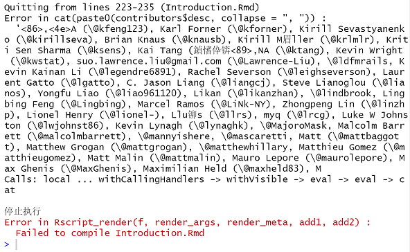

In order to compile Advanced R into a PDF, I installed the MiKTex and Rmarkdown packages  before compiling (Note: added a path in the system settings).

### Download the Source: 
https://github.com/hadley/adv-r/archive/master.zip

### Install R Package dependencies
```{r eval=FALSE}
devtools::install_github("hadley/sloop")
devtools::install_github("hadley/emo")
```
### Compile the book
```{r eval=FALSE}
bookdown::render_book("index.Rmd", output_format = "bookdown::pdf_book")
```


During the building process, I've met several problems, the followings are the errors I've met and how I solved them. 

# rlang0.4.0
```{r fig.align='center'}
knitr::include_graphics("error/1.PNG")
```

To solve it, I removed `rlang` and then reinstalled it.
```{r eval=FALSE}
remove.packages("rlang")
install.packages("munsell")
install.packages("rlang")
```


# Failed to install "emo" from Github:
```{r fig.align='center'}
knitr::include_graphics("error/2.PNG")
```

To solve this problem,I executed the following command in Git.
```{r eval=FALSE}
$ git config --global http.sslBackend "openssl"
$ git config --global http.sslCAInfo E:/R/R-3.6.1/library/openssl/cacert.pem 
```


# Quitting from lines 223-235 (Introduciton.Rmd)
```{r fig.align='center'}

```

Adding `encoding = "UTF-8"` in line 224 can fix it. The line 224 is displayed as
```{r eval=FALSE}
contributors <- read.csv("contributors.csv", stringsAsFactors = FALSE,encoding = "UTF-8")
```


# Missing Packages
Most of the warnings are packages missing. Use install.packages() to solve this kind of problem. The packages I installed during the process are glue, lubridate, purr, stringing, Rcpp, tinytex, dbplyr, etc.


# Fonts cannot be found
```{r fig.align='center'}
knitr::include_graphics("error/4.PNG")
```
I downloaded the font `Inconsolate` and `Andale Mono` from the internet.

After solving these problems, the book was successfully built.


